# ontodocker

Prerequisites: Docker and docker-compose 

### Keycloak installation and configurations

 **You must configure Keycloak first!**

Go to the keycloak directory, edit password in `Dockerfile` and `docker-compose.yml`.

Start Keycloak container with
```bash
docker-compose up -d --build
```
in the terminal (cmd)

check the status
```bash
docker-compose logs keycloak
```

After the start, (You have to wait until Keycloak is completely ready and you'll see the line `Running the server in development mode. DO NOT use this configuration in production.` in terminal.)

go to http://localhost:8080, enter the admin password set in the `Dockerfile`, then you'll see the homepage of Keycloak


Now we need to create a client for our application.

1. Fill in the basic information, e.g. email, name (we need this). And then Save
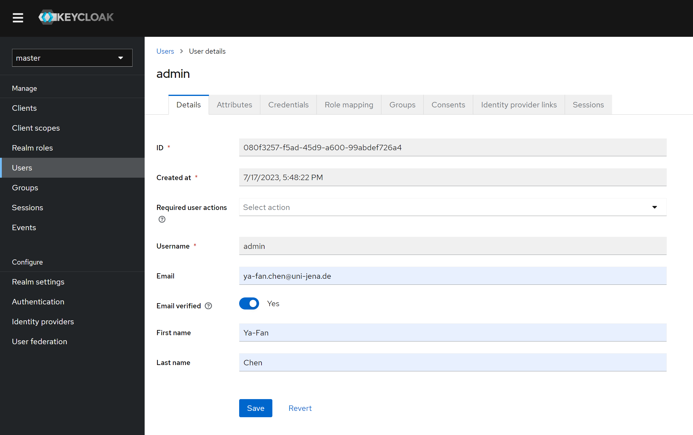

2. Create client for our application


3. Get client secret (client secret is required .env)

4. Use roles to control access to the application
   
    create Realm roles: `App-admin`, `App-insider`, `App-guest`

    (If you don't know what roles mean in Keycloak, see https://stackoverflow.com/questions/47837613/how-are-keycloak-roles-managed)

    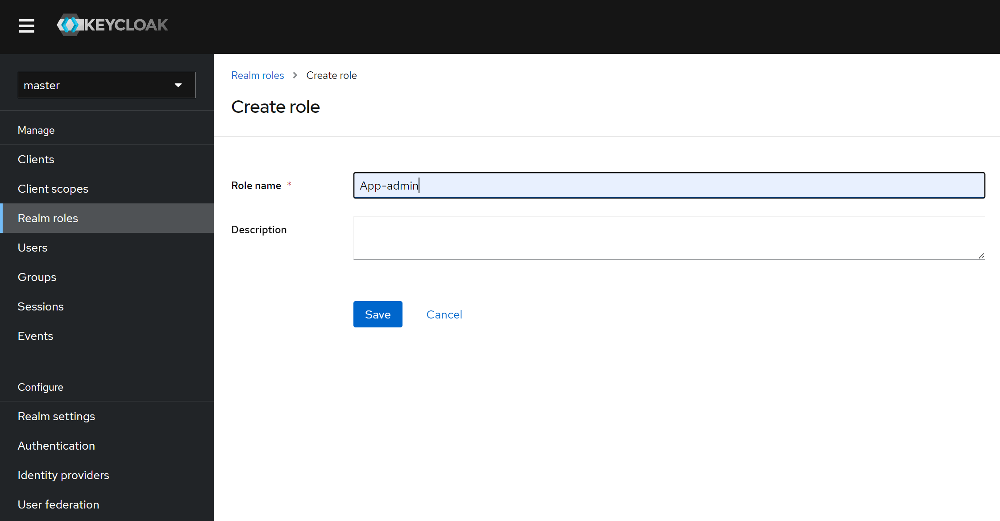
    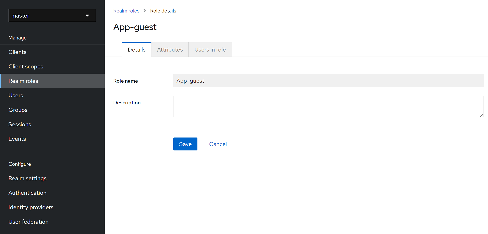
    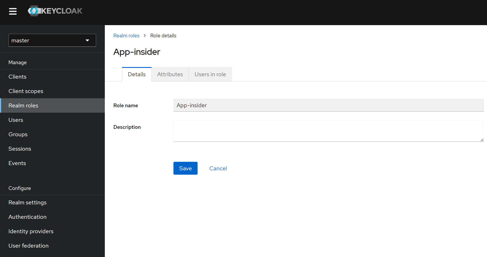

    Now we're going to assign roles to users, e.g., assign `App-insider` role to user `test_insider`
    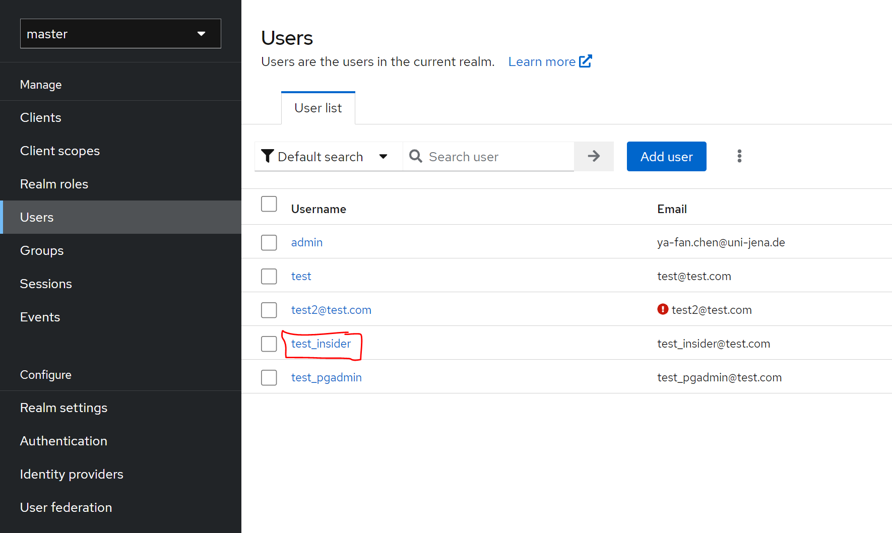
    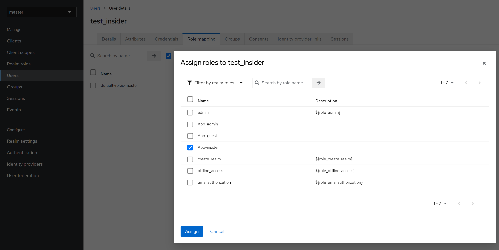
    As you can see, the "admin" role is already created by keycloak by default. The `App-admin` role was created for demo purposes and has the same effect as the `admin` role.

    Make sure that client scope `roles` is assigned to the client `glass`, if not, add the client scope `roles` to `glass`
    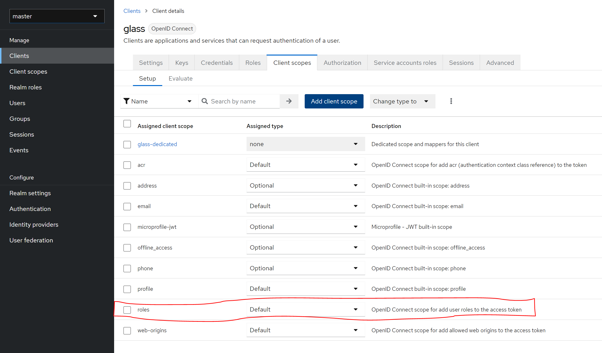
    Now go to Client scopes (left panel), enter roles page:
5.
    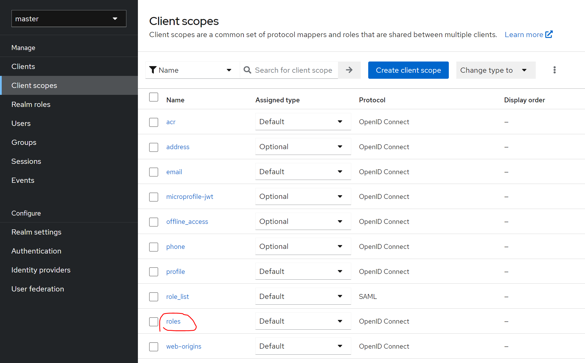
    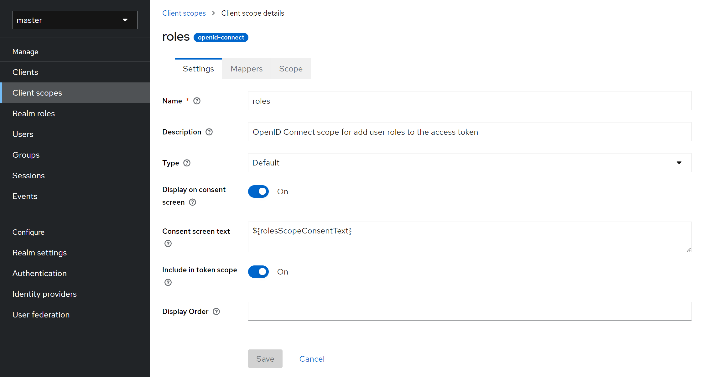
    modify `realm roles` & `client roles` as below:
    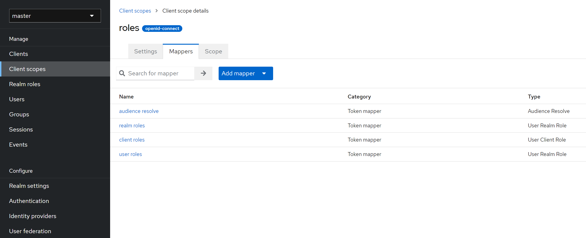
    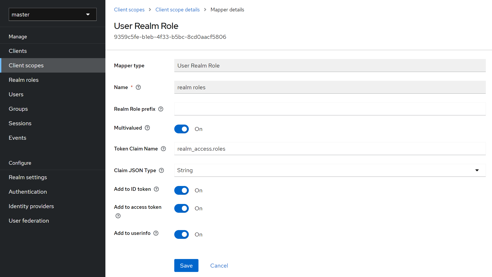
    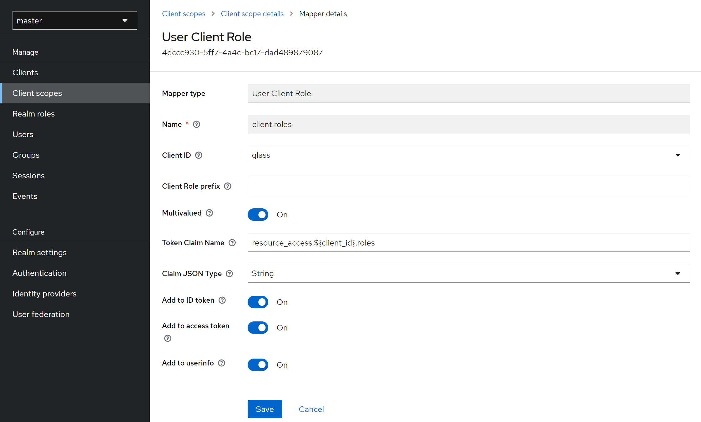
    Apparently we only use the realm roles, but it can't hurt to set client roles together


**Now you have done the Keycloak configuration part!**

### ontodocker installation

Once you have done the keycloak configuration part. Go back to the parent directory (`cd ..`)

Create a `.env` file with the following contents and fill or change them accordingly.
```
ONTODOCKER_RUN_PORT=8000
ADMIN_EMAIL=
JWT_SECRET_KEY=BvaH6klszRim4QX8709gAgUcJRQ
JWT_DEFAULT_DAYS_VALID=90
JWT_MIN_DAYS_VALID=1
JWT_MAX_DAYS_VALID=90
MAX_SESSION_TIME_IN_DAYS=14
FUSEKI_ADMIN_USER=admin
FUSEKI_ADMIN_PW=changeme
APP_URI=http://fastapi:8000
KEYCLOAK_HOST=http://keycloak:8080
KEYCLOAK_REALM=master
KEYCLOAK_CLIENT_ID=ontodocker
KEYCLOAK_CLIENT_SECRET=
KEYCLOAK_ROLES_ADMIN=App-admin,admin
KEYCLOAK_ROLES_RW=App-insider
KEYCLOAK_ROLES_RO=App-guest
ALLOW_UNAUTHORIZED_READONLY_API_ACCESS=false
ALLOW_UNAUTHORIZED_READONLY_UI_ACCESS=true
```

Create a random key for `JWT_SECRET_KEY`   by excecuting
```
openssl rand -hex 36
```
in a command line and fill the line in the `.env` file.


Edit the Fuseki admin password (`ADMIN_PASSWORD`) as well and `JAVA_OPTIONS` for Java Virtual Machine (JVM) memory settings in `docker-compose-dev.yml`.

Create a symlink to `docker-compose-dev.yml` by using
```
ln -s docker-compose-dev.yml docker-compose.yml
```

Build the docker container with
```bash
docker-compose build
```

Start the docker container with
```bash
docker-compose up -d 
```

Watch the logs with
```bash
docker-compose logs -f
```
Now you may go to http://localhost:8000


## Authors & Acknowledgment
Robert Heimsoth (DECOIT GmbH & Co. KG)
Jannis Grundmann (Leibniz-Institut für Werkstofforientierte Technologien - IWT) 

Based on FastOntodocker by Ya-Fan Chen (ya-fan.chen@uni-jena.de)