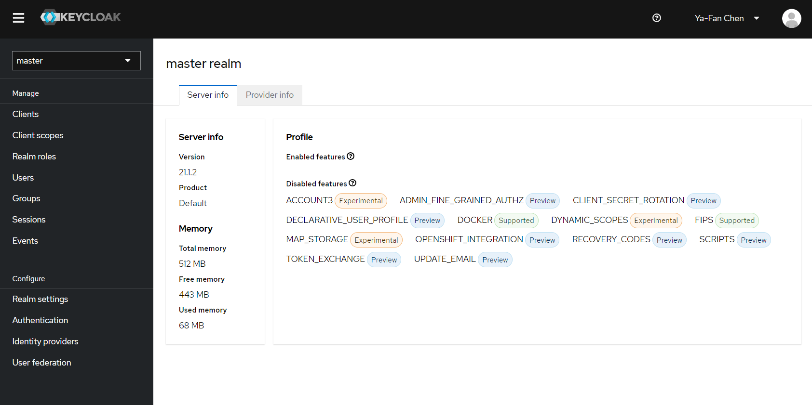
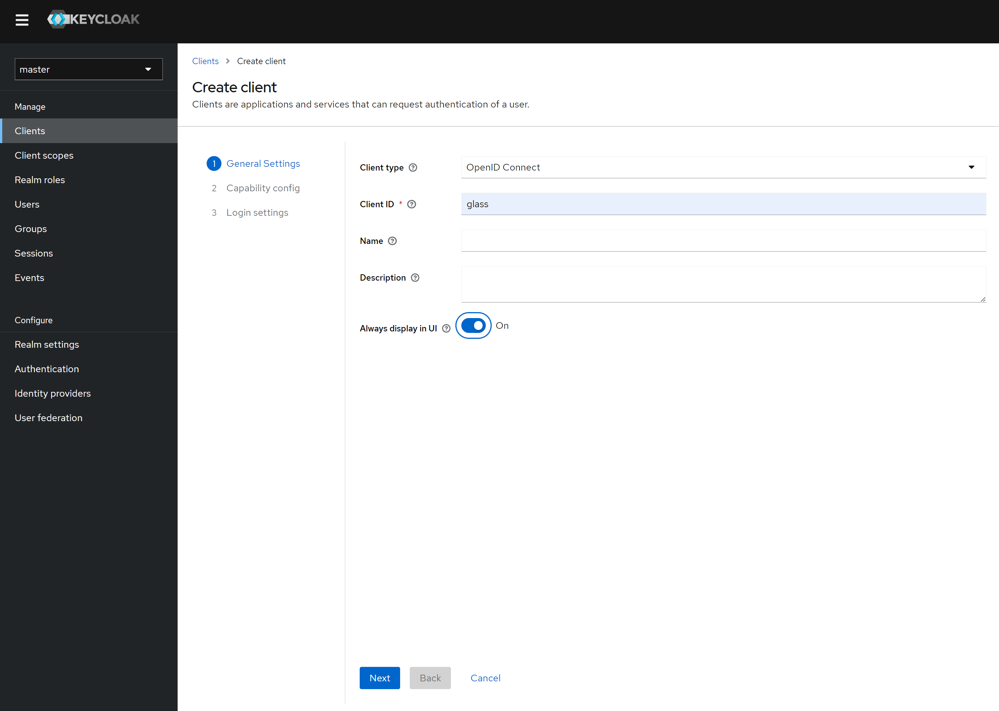
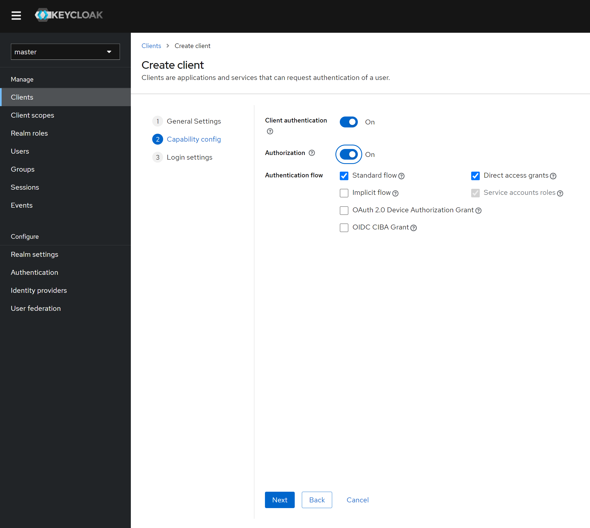
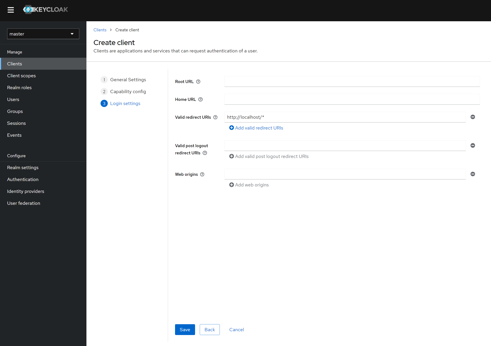
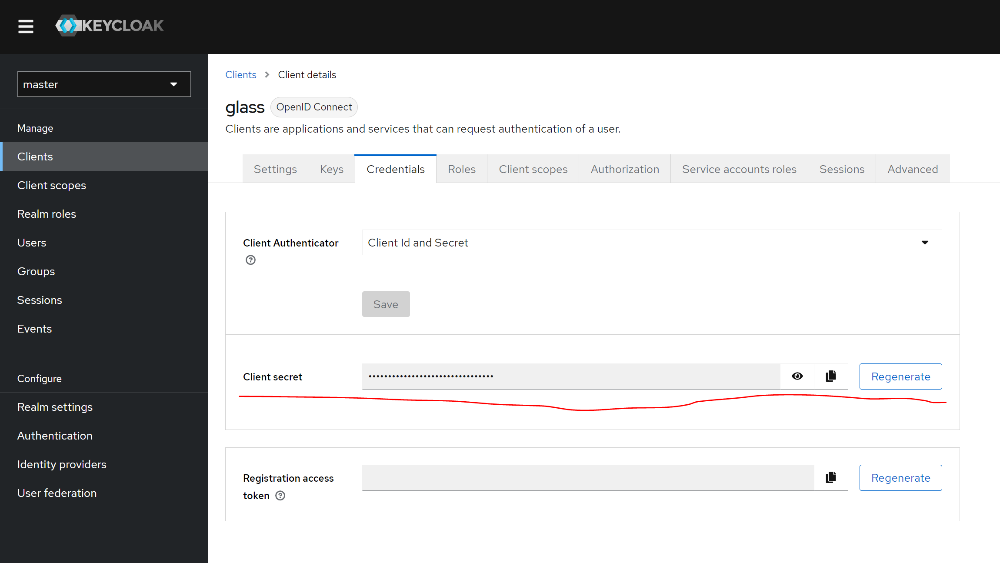

# ontodocker

Prerequisites: Docker and docker compose 

### Ontodocker installation

The keycloak part below is optional and can be skipped if usage is local only or a keycloak instance already exists.

Create a `.env` file in the ontodocker parent directory with the following contents and fill or change them accordingly.
```
ONTODOCKER_RUN_PORT=8000
JWT_SECRET_KEY=
JWT_DEFAULT_DAYS_VALID=90
JWT_MIN_DAYS_VALID=1
JWT_MAX_DAYS_VALID=90
MAX_SESSION_TIME_IN_DAYS=14
FUSEKI_ADMIN_USER=admin
FUSEKI_ADMIN_PW=changeme
ALLOW_UNAUTHORIZED_READONLY_API_ACCESS=false
ALLOW_UNAUTHORIZED_READONLY_UI_ACCESS=true
ANONYMOUS_IS_ADMIN=false
```

Create a random key for `JWT_SECRET_KEY` by excecuting
```
openssl rand -hex 36
```
in a command line and append it to the line `JWT_SECRET_KEY=` in the `.env` file.

Important: If you start the application for the first time set `ANONYMOUS_IS_ADMIN` to `true` and `ALLOW_UNAUTHORIZED_READONLY_UI_ACCESS` to `true`. That will give you administration access to configure local users or SSO Providers (like Keycloak (description below)) in the Administration interface.
If you only need a local developing instance you can also fully use the anonymous user except for saving SPARQL queries.

Edit the Fuseki admin password (`FUSEKI_ADMIN_PW=`) in the `.env` as well (e.g. execute `openssl rand -hex 36` again).

Create a symlink to `docker-compose-dev.yml` by using
```
ln -s docker-compose-dev.yml docker-compose.yml
```

Build the docker container with
```bash
docker compose build
```

Start the docker container with
```bash
docker compose up -d 
```

Watch the logs with
```bash
docker compose logs -f
```
Now you may go to http://localhost:8000

### Keycloak installation and configurations (optional)

Go to the keycloak directory, edit password in `Dockerfile` and `docker-compose.yml`. And watch for the KC_HOSTNAME_URL if you plan to access keycloaks admin interface from a different IP.

Start Keycloak container with
```bash
docker compose up -d --build
```
in the terminal (cmd)

check the status
```bash
docker compose logs -f keycloak
```

After the start, (You have to wait until Keycloak is completely ready and you'll see the line `Running the server in development mode. DO NOT use this configuration in production.` in terminal.)

go to http://localhost:8080 (or your IP where you installed the keycloak), enter the admin password set in the `Dockerfile`, then you'll see the homepage of Keycloak



Now we need to create a client for our application.


1. Create client for your application (in screenshot the client id is `glass` but you can name it whatever you want).
Also be sure that the valid redirect URL contains the port (default e.g. 8000, like `http://{yourip}:8000/*`)



3. Get client secret


The .well-known URL is normally `http://{your_keycloak_ip}:8080/realms/master/.well-known/openid-configuration`
Apparently we only use the realm roles, but it can't hurt to set client roles together


**Now you have done the Keycloak configuration!**


### Known Issues

If the container is accessed via a nginx reverse proxy and the login redirect does not work, try to add the following lines to its .conf 
```
proxy_set_header    Host               $host;
proxy_set_header    X-Real-IP          $remote_addr;
proxy_set_header    X-Forwarded-For    $proxy_add_x_forwarded_for;
proxy_set_header    X-Forwarded-Host   $host;
proxy_set_header    X-Forwarded-Server $host;
proxy_set_header    X-Forwarded-Port   $server_port;
proxy_set_header    X-Forwarded-Proto  $scheme;
proxy_set_header    ssl-client-cert    $ssl_client_escaped_cert;
```


