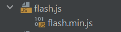
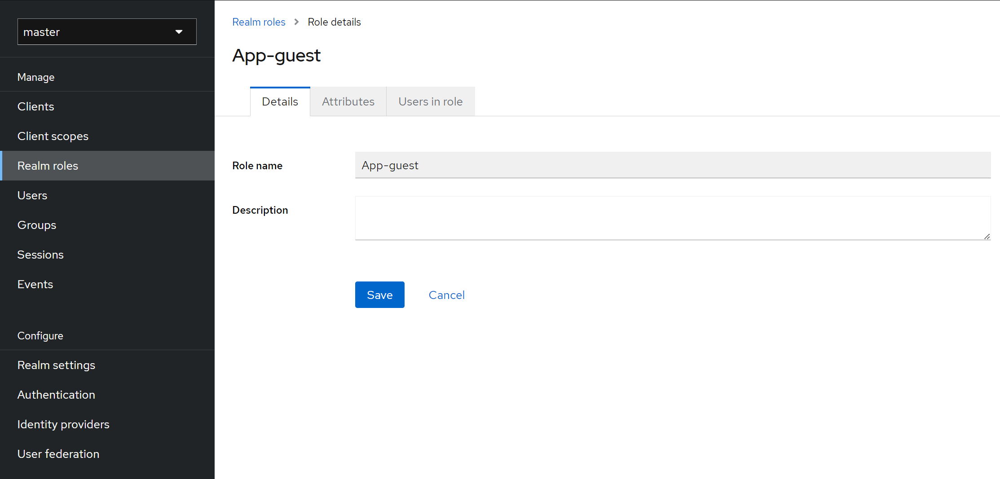
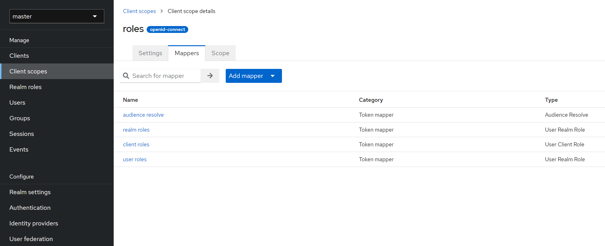

# Fast Ontodocker

Fast Ontodocker is a rebuilt version of [Ontodocker](https://git.material-digital.de/apps/ontodocker) built with [FastAPI](https://fastapi.tiangolo.com/),  a modern, fast (high-performance) web framework.

Before you start, you are advised to read the [PMD Deployment Guide](https://materialdigital.github.io/pmd-server/) first.

## Demo Preview

see https://unijena365-my.sharepoint.com/:v:/g/personal/ya-fan_chen_uni-jena_de/Ef7TfYMXhx5BruOzg5s6K1sBNJhWBuhQb2PHBzMxOIHOFg?e=lACtUB

## Features and Intergration

All services are running in Docker.
- Backend: FastAPI + Python 3.11
- Frontend:
    1. CSS Framework: [Bootstrap 5.3.0](https://getbootstrap.com/)

    2. Table: [DataTables](https://datatables.net/) or [Handsontable](https://handsontable.com/) (Free for non-commercial projects)
    
        
    - DataTables with search funcitons and export buttons (no editing)
            
    - Handsontable with context menu  (Spreadsheet like + edit)               
    3. Graph: [Plotly](https://plotly.com/javascript/) 
    (Scatter, Histogram, Ternary, and Timeseries plots are used)
    4. SPARQL code editor: [CodeMirror](https://codemirror.net/5/mode/sparql/) or using an intergrated editor [Yasgui: Yet Another Sparql GUI](https://yasgui.triply.cc/) (same code editor in Fuseki UI) with code hints and result display in the table or raw response ( --> [CodeMirror](https://codemirror.net/5/mode/sparql/) + [DataTables](https://datatables.net/)).
            
        
        **Note**: I disable the integrated table functions of Yasgui and display the results in the self-created table (DataTables) to be able to manipulate the data in a better way.
    5. Ontology documentation and visualization (using VOWL):

    6. User Query UI: This is a project specific task. Below is an example for the query of glass oxides and their properties
    

    7. **Data Pipeline (New)**: (will release soon)

- TripleStore: Apache Jena Fuseki 4.8 
- Identity and Access Management: Keycloak 22 + PostgreSQL 15
- Proxy: [Nginx Proxy Manager](https://nginxproxymanager.com/) (for production)

- Add-on features (GlasDigital only):
    1. Glass prediction with ML model
     
    (ML models trained by [Felix Arendt](https://www.cmsg.uni-jena.de/about-us/staff))

    2. Patent Extraction
     
    (Collaboration with [Sebastian Kempf](https://www.informatik.uni-wuerzburg.de/is/mitarbeiter/kempf-sebastian/) and [Prof. Dr. Frank Puppe](https://www.informatik.uni-wuerzburg.de/is/mitarbeiter/puppe-frank/) from Universität Würzburg)

## IDE choice

I use [PyCharm 2023.1 Professional](https://www.jetbrains.com/pycharm/download/?section=windows) (Free educational license) + [Docker Desktop](https://www.docker.com/products/docker-desktop/)

With them, you can easily start Docker containers and develop stuffs. A greate feature of Pycharm Professional Edition is that you can [minify your JavaScript](https://www.jetbrains.com/help/pycharm/minifying-javascript.html) and [CSS](https://www.jetbrains.com/help/phpstorm/compressing-css.html) files on the fly, which is good for production.



## Local development installation

Prerequisite: Docker installed

### **You must configure Keycloak first!**


### Keycloak installation and configurations

Go to keycloak directory, edit password in `Dockerfile` and `docker-compose.yml`.

Start Keycloak container with
```bash
docker-compose up -d --build
```
in the terminal (cmd)

check the status
```bash
docker-compose logs keycloak
```

After the start, (You have to wait until Keycloak is completely ready and you'll see the line `Running the server in development mode. DO NOT use this configuration in production.` in terminal.)

go to http://localhost:8080, enter the admin password set in the `Dockerfile`, then you'll see the homepage of Keycloak


Now we need to create a client for our application.

1. Fill in the basic information, e.g. email, name (we need this). And then Save


2. Create client for our application


3. Get initial access token and client secret (client secret is required in config.py)


4. Use roles to control access to the application
   
    create Realm roles: `App-admin`, `App-insider`, `App-guest`
   
    (In this demo I created these 3 roles for access control)

    (If you don't know what roles mean in Keycloak, see https://stackoverflow.com/questions/47837613/how-are-keycloak-roles-managed)

    
    
    

    Now we're going to assign roles to users, e.g., assign `App-insider` role to user `test_insider`
    
    
    As you can see, the "admin" role is already created by keycloak by default. The `App-admin` role was created for demo purposes and has the same effect as the `admin` role.

    Make sure that client scope `roles` is assigned to the client `glass`, if not, add the client scope `roles` to `glass`
    
    Now go to Client scopes (left panel), enter roles page:
5.
    
    
    modify `realm roles` & `client roles` as below:
    
    
    
    Apparently we only use the realm roles, but it can't hurt to set client roles together


**Now you have done the Keycloak configuration part!**

### Fast Ontodocker installation

Once you have done the keycloak configuration part. Go back to the parent directory (`cd ..`)

1. Edit the Fuseki admin password (`ADMIN_PASSWORD`) and `JAVA_OPTIONS` for Java Virtual Machine (JVM) memory setting in `docker-compose.yml`.

2. Edit the `Settings`, `KeycloakSettings` and `FusekiSettings` classes in `config.py`.


Start Fast Ontodocker docker container with
```bash
docker-compose up -d --build
```

if everything goes well like below


**Now you may go to http://localhost to see it!**

This repository contains a example dataset in Fuseki, which is located in `fast-ontodocker/fastapi_app/data/fuseki/databases`, called `SciGlass`, and its configuration file is located in `fast-ontodocker/fastapi_app/data/fuseki/configuration` called `SciGlass.ttl`


## Production installation [To be added later]

Prerequisite: 
1. a Linux system server
1. Docker installed
1. SSL Certificates for your domain name
1. Reverse Proxy configuration using [Nginx Proxy Manager](https://nginxproxymanager.com/) (for production) (has automatically generated Free SSL with Let's Encrypt)

In GlasDigital we use SSL certificates issued from the University. Please contact the related office of your institution for website domain&certificates.


**Using the "production" branch for source codes.**

Start the containers in the order you started them in development mode.

[add later]

## Important notes on performance

Do not perform blocking operations inside async routes as below

```
@app.get("/task")
async def heavy_task():
    time.sleep(10) # this will block the main thread for 10s
```
Instead, use non-blocking I/O within async routes as below

```
@app.get("/task")
async def heavy_task():
    await some_heavy_task() # this will not block main thread
```
Or use normal `def`
```
@app.get("/task")
def heavy_task():
    time.sleep(10) # this will block for 10s, but in another thread 
```


see: [Concurrency and async / await](https://fastapi.tiangolo.com/async/) for more details


## Troubleshoot

While developing on Win10, I run into some following problems when starting the container:
1. > An attempt was made to access a socket in a way forbidden by its access permissions

    This could be solved by executing

    ```bash
    net stop winnat
    net start winnat
    ```
    in the cmd (Run as administrator)


2. > Localhost Refused to Connect

    This could be solved by using your IPv4 address instead.


If you are having other problems, please create an issue and include the error message so I can help troubleshoot.

## Authors and acknowledgment

Author: Ya-Fan Chen<br>
Email: ya-fan.chen@uni-jena.de

Otto-Schott-Institut für Materialforschung<br>
Friedrich-Schiller-Universität Jena<br>
Löbdergraben 32<br>
D-07743 Jena, Germany<br>

For more information about GlasDigital, please visit the [Platform MaterialDigital](https://www.materialdigital.de/project/4).

